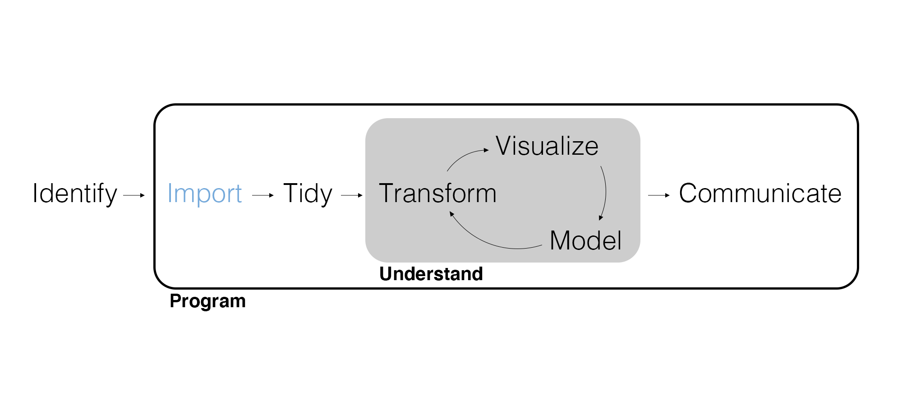
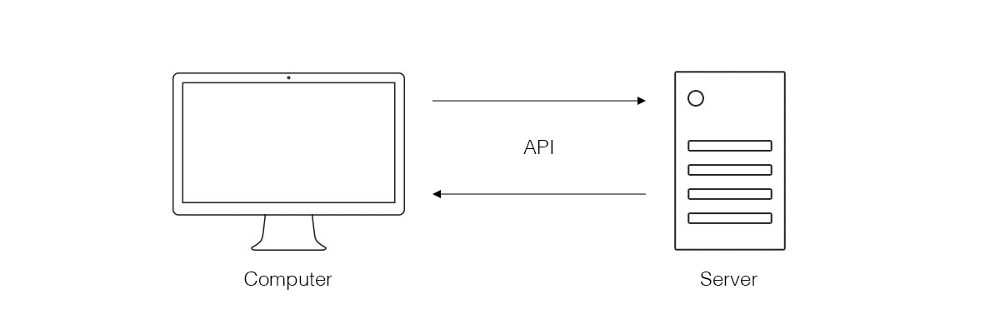
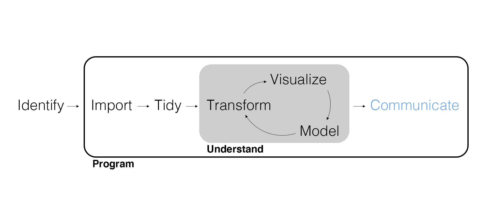
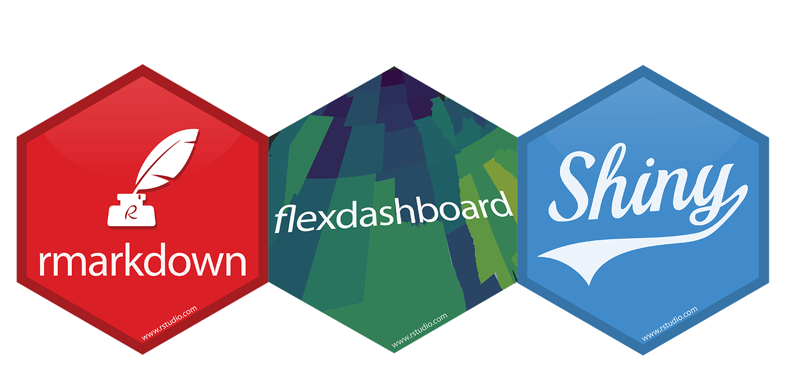
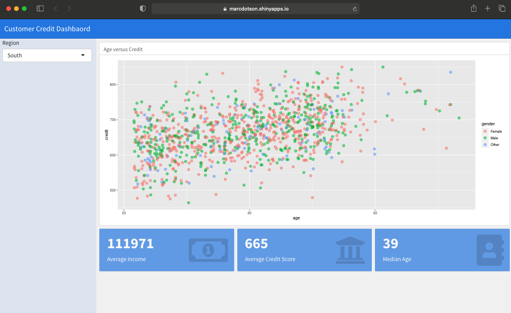
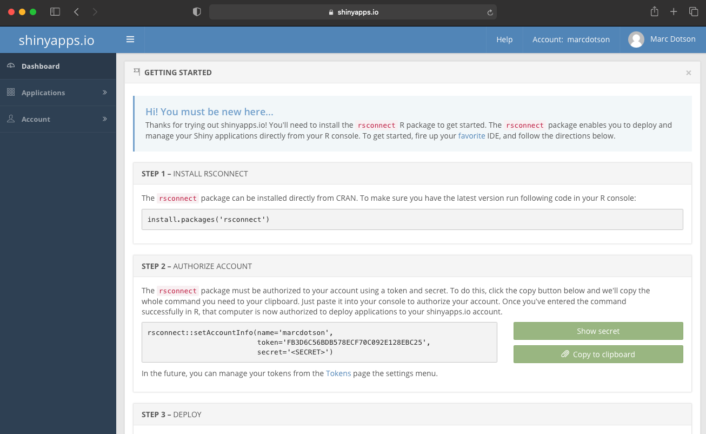
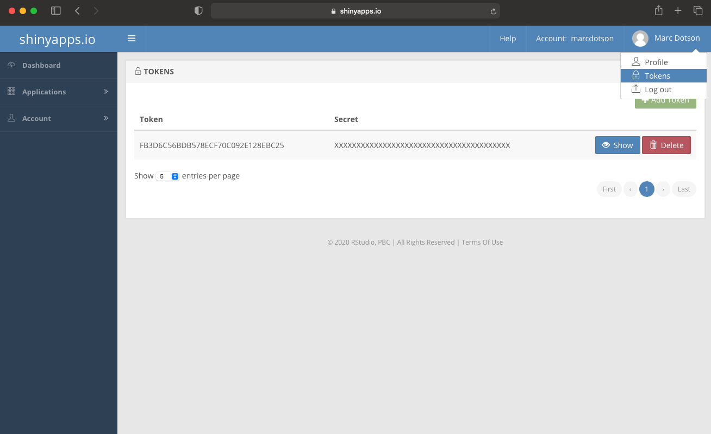
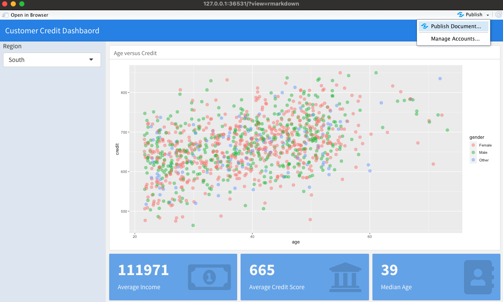

## Marketing Analytics Process

<center>
{width=900px}
</center>

## Motivating Example

Now that your supervisor has seen you successfully work with the PostgreSQL database, she wants you to access some survey data through an API. Have you used an API before?

Additionally, she wants you to find some way to display all of these visualizations in a more interactive format. She would like to avoid having to create a long report filled with scatterplots of every single combination of numerical variables, for example. How might this be accomplished?


## APIs

Databases are a type of server. Instead of querying a database, **APIs** (Application Programming Interfaces) are a *general* way to access any server that provide permission to access data along with securely controlling what and how much data you can access.

<center>
{width=850px}
</center>

## API Clients

Just like SQL has a variety of *backends*, to use an API you should use an **API client** specific to the server. Also like SQL backends, there are a plethora of R packages that provide API clients for specific servers (e.g., {twitteR}, {Rfacebook}, {RGoogleAnalytics}, {WikipediR}, {qualtRics}). API clients differ, but they typically require at least:

- Key: An API key is like a username that can change.
- Token: An API token is like a password that can change.

## Use an API

Install and load the {qualtRics} package so that we can access the survey data. Remember to press Tools then Install Packages to install it before trying to load it.

In the console (NOT a code chunk), call the following:

```{r eval=FALSE}
qualtRics::qualtrics_api_credentials(
  api_key = "Ir2JDPvhOjSmMIpWo8bwVUAbvPs6uwGqIKipAuo6", 
  base_url = "sjc1.qualtrics.com"
)

readRenviron("~/.Renviron")
```

## Import Data

We can see what surveys are available to download.

```{r eval=FALSE}
all_surveys()
```
```
A tibble:31 × 6
id
<chr>
name
<chr>
SV_1TFWeGsZETeQ8iF	BYU Football Games - Version 2	
SV_22X0es9h7D1oeZ7	Exploratory Survey	
SV_3QoN1MI4YB7AMM5	Ad Test1	
SV_6QYEA2VoFvNUDyd	Jones Creek Beef - Segmentation Survey	
SV_73xYIxZuxsqAx6Z	Hammocks Are Life	
SV_87KkMWnKXeqCS4R	Traeger Segmentation - 2018	
SV_0HQgoMnDwrNr94h	Marketing Analytics (Winter 2017)	
SV_0rn3HbR4AEc1BUG	Patagonia Survey	
SV_1ZI97M8G0xOckwl	Statistics in Marketing Research	
SV_3eXBQuVE8opSXgp	Marketing Core Evaluation
```

---

We can import data by using the survey ID.

```{r eval=FALSE}
survey_data <- fetch_survey("SV_8B5zozRL3hVr8dU")

survey_data
```

```
# A tibble: 34 x 42
   StartDate           EndDate             Status IPAddress Progress `Duration (in s… Finished RecordedDate        ResponseId
   <dttm>              <dttm>              <chr>  <chr>        <dbl>            <dbl> <lgl>    <dttm>              <chr>     
 1 2020-12-30 00:48:52 2020-12-30 00:50:34 Surve… NA             100              102 TRUE     2020-12-30 00:50:35 R_AM9A0iN…
 2 2020-12-30 00:50:42 2020-12-30 00:52:21 Surve… NA             100               99 TRUE     2020-12-30 00:52:22 R_1eLAhrD…
 3 2020-12-30 01:12:15 2020-12-30 01:14:13 IP Ad… 69.21.24…      100              117 TRUE     2020-12-30 01:14:13 R_2VQ1b90…
 4 2020-12-30 01:12:11 2020-12-30 01:14:39 IP Ad… 98.161.1…      100              147 TRUE     2020-12-30 01:14:39 R_2DU1SWB…
 5 2020-12-30 01:12:17 2020-12-30 01:16:52 IP Ad… 136.36.6…      100              275 TRUE     2020-12-30 01:16:52 R_3RxwMy2…
 6 2020-12-30 01:56:33 2020-12-30 02:03:35 IP Ad… 47.216.3…      100              422 TRUE     2020-12-30 02:03:36 R_2SdDsLb…
 7 2020-12-30 02:01:39 2020-12-30 02:07:50 IP Ad… 107.77.2…      100              371 TRUE     2020-12-30 02:07:51 R_3kp0i4h…
 8 2020-12-30 02:18:40 2020-12-30 02:21:04 IP Ad… 71.214.1…      100              144 TRUE     2020-12-30 02:21:04 R_2wzwNjg…
 9 2020-12-30 02:48:46 2020-12-30 02:53:16 IP Ad… 70.163.1…      100              270 TRUE     2020-12-30 02:53:16 R_3Jzv2iX…
10 2020-12-30 03:26:36 2020-12-30 03:29:49 IP Ad… 98.202.1…      100              193 TRUE     2020-12-30 03:29:50 R_3HFeUj9…
# … with 32 more rows, and 35 more variables: RecipientLastName <lgl>, RecipientFirstName <lgl>, RecipientEmail <lgl>,
#   ExternalReference <lgl>, LocationLatitude <dbl>, LocationLongitude <dbl>, DistributionChannel <chr>, UserLanguage <chr>, Q1 <ord>,
#   Q2 <chr>, Q3 <chr>, Q4 <chr>, Q5 <chr>, Q6 <ord>, Q7 <chr>, Q8 <chr>, Q9 <ord>, Q10 <ord>, Q11 <ord>, Q12 <ord>, Q13_1 <chr>,
#   Q13_2 <chr>, Q13_3 <chr>, Q13_6 <chr>, Q13_7 <chr>, Q13_8 <chr>, Q13_9 <chr>, Q13_12 <chr>, Q13_13 <chr>, Q13_14 <chr>,
#   Q13_15 <chr>, Q14 <chr>, Q15 <ord>, Q16 <ord>, Q17 <ord>
```

## Good Practices

We've discussed a few good practices when it comes to importing data:

- Disconnect from databases after importing data.
- Don't save sensitive credentials in your code.
- Write data locally (with permission) once it's been imported.

When we import data from a server in Quarto, every time we render the document it will re-execute and eat up server bandwidth (i.e., database access or API calls). It's better to do this once and then, if we need to show how we got the data, include the code with the relevant cell set to `#| eval: false`.

## Your Turn!

Save the data locally as a CSV like we learned how to last time. Then set the chunk where you accessed the survey data to `#| eval: false`.

## Solution 

```{r}

survey_data |> 
  write_csv("Data", "store_revenue.csv")

```


## Marketing Analytics Process

<center>
{width=900px}
</center>

---

{width=920px}

## Data Products

Remember that an analyst needs to interpret and communicate insights in a way that **clearly informs the managerial decision**. The form that communication takes depends on the audience.

- Professional visualizations are essential.
- Reports and presentations provide context, details, and explanations.
- Dashboards and webapps enable interacting with the data.
- APIs allow direct access to data, models, and results.

Dashboards, webapps, and APIs are examples of **data products**, ways to share data, models, and results interactively.

## Dashboards

We can use **dashboards** to interactively report on key performance indicators, visualizations, and data exploration. We can build dashboards using R Markdown. We'll also use [{shiny}](https://shiny.rstudio.com) functions, the industry-standard for webapps, to make the dashboard interactive.

Install the {markdown}, {rmarkdown}, {flexdashboard}, {shiny}, and {rsconnect} packages. Create a new dashboard by creating an **R Markdown** document > **From Template** > **Flex Dashboard**.

## Patagonia CRM Dashboard

We'll be building [this CRM dashboard](https://marcdotson.shinyapps.io/patagonia_crm/).

<center>
{width=850px}
</center>

## YAML

```
---
title: "Patagonia CRM Dashboard"
output: 
  flexdashboard::flex_dashboard:
    orientation: rows
    vertical_layout: scroll
runtime: shiny
---
```

We have a new `output` (R Markdown's `format`) with its own arguments:

- `orientation` is the dashboard layout, either `columns` or `rows`.
- `vertical_layout` is how the dashboard fits, either `fill` or `scroll`.

To use shiny functions, we also need to add `runtime: shiny` to the YAML. **Pay attention to the white space in the YAML!**

## Setup

The first code cell is named `setup` and has `#| include: false` (the opposite of `#| eval: false`). Load packages and import data with *minimal* wrangling (it really should be already-wrangled data).

Note that the data **must be in the same folder as the dashboard .Rmd** which is also the *working directory* for the dashboard.

```{r eval=FALSE}

# Load packages.

library(tidyverse)
library(flexdashboard)
library(shiny)
library(rsconnect)

# Import data.

customer_data <- read_csv("customer_data.csv") |> 
  mutate(age = 2023 - birth_year)
```

## Layout | Add Rows and Columns

Depending on the `orientation` argument, additional elements will be in rows or columns. You can manage your dashboard layout by adding additional rows and columns.

```
Row
------------------------------------------
```

or 

```
Column
------------------------------------------
```

Code cells following the row or column header will show up in that row or column.

---

<center>
{width=900px}
</center>

---

<center>
{width=900px}
</center>

## Layout | Add a Sidebar

The interactive elements of a dashboard are conveniently included in a sidebar. Let's add one.

```
Sidebar {.sidebar}
------------------------------------------
```

Code cells following the sidebar header will show up in the sidebar.

## Input Functions

**Input functions** make the dashboard interactive. They allow the use to select or input variables which in turn adjust the visualizations. There are many different input functions, but they all include an input ID and an input label.

Let's add one to the sidebar.

```{r eval=FALSE}

selectInput(
  inputId = "region",
  label = "Region",
  choices = unique(customer_data$region)
)
```

Note that `customer_data$region` is a way to `select(customer_data, region)` without {dplyr}. Furthermore, we can't run this code cell on it's own -- we need to render the entire document to see the dashboard.

## Render Functions

Visualizations are at the heart of any interactive dashboard. In order to reference a *reactive* element like the input function we need to create the plot in a *reactive* environment using **render functions**.

Let's add a row, name the dashboard element within the row with a sub-heading `### Age and Credit`, and use a render function to add a plot.

```{r eval=FALSE}

renderPlot({
  customer_data |> 
    filter(region == input$region) |> 
    ggplot(aes(x = age, y = credit, color = gender)) +
    geom_jitter(size = 3, alpha = 0.5)
})
```

Note that to call an input you use `input$inputid`.

---

Let's add another row, name the dashboard element within the new row with a sub-heading `### Average Income`, and use another render function to produce a numeric summary in a call-out box with [favicon](https://fontawesome.com/v4.7.0/icons/).

```{r eval=FALSE}
# Add a value box (numeric summary).
renderValueBox({
  # Compute the average income.
  avg_income <- customer_data |> 
    filter(region == input$region) |> 
    summarize(avg_income = mean(income)) |> 
    pull()
  
  # Print the average income in a value box.
  valueBox(round(avg_income), icon = "fa-money")
})
```

---

Within the same row, let's add a second call-out box named `### Average Credit Score`.

```{r eval=FALSE}
# Add a value box (numeric summary).
renderValueBox({
  # Compute the average credit.
  avg_credit <- customer_data |> 
    filter(region == input$region) |> 
    summarize(avg_credit = mean(credit)) |> 
    pull()
  
  # Print the average credit in a value box.
  valueBox(round(avg_credit), icon = "fa-bank")
})
```

---

Finally, let's add a third call-out box named `### Median Age`.

```{r eval=FALSE}
# Add a value box (numeric summary).
renderValueBox({
  # Compute the median age.
  med_age <- customer_data |> 
    filter(region == input$region) |> 
    summarize(med_age = median(age)) |> 
    pull()
  
  # Print the median age in a value box.
  valueBox(med_age, icon = "fa-address-book")
})
```

## Publish a Dashboard

A dashboard is a kind of webapp and needs to be hosted on a server to share. Sign up for a free [shinyapps.io account](https://www.shinyapps.io/admin/#/signup), choose a username, and authorize API access with an API token and secret, which you'll need to *show and copy*.

<center>
{width=900px}
</center>

---

You can find your API token and secret again under *Tokens*.

<center>
{width=900px}
</center>

---

You can then publish your rendered dashboard.

<center>
{width=900px}
</center>

---

Treat the title like a variable name and publish (which may take a few minutes)!

<center>
{width=900px}
</center>

## Live Coding Exercise

What if we would like to add a regression line to our plot? How can we do that?

## Wrapping Up

*Summary*

- Discussed communicating marketing insights with your audience in mind.
- Walked through creating a dashboard with R Markdown and {shiny}.

*Next Time*

- Our first project week!

*Supplementary Material*

- [More on {flexdashboard}](https://pkgs.rstudio.com/flexdashboard/index.html)
- [*Mastering Shiny*](https://mastering-shiny.org)

## Exercise 7

In RStudio, do the following in *two* documents.

1. In a Quarto document with `format: docx`, wrangle the customer data to include the total amount spent in-store for each customer. Write this data as a CSV file *in the Exercises folder*.
2. In an R Markdown document, modify the dashboard from class by importing the new data, adding a second input function to the sidebar to select from `college_degree`, modifying the plot to filter on both input functions, replacing age with total amount spent in-store in the plot, and modifying the call-out boxes to filter on both input functions.
3. Knit the R Markdown document and publish it on shinyapps.io. Include the link at the end of the Quarto document (add a link with `[text](URL)`), rendered as a Word document, and upload to Canvas.
4. Before Tuesday, download and install the latest version of [R](https://cran.r-project.org/) and [RStudio](https://posit.co/download/rstudio-desktop/) (in that order). (If you have a Mac, note the difference between Intel and Apple silicon!)

